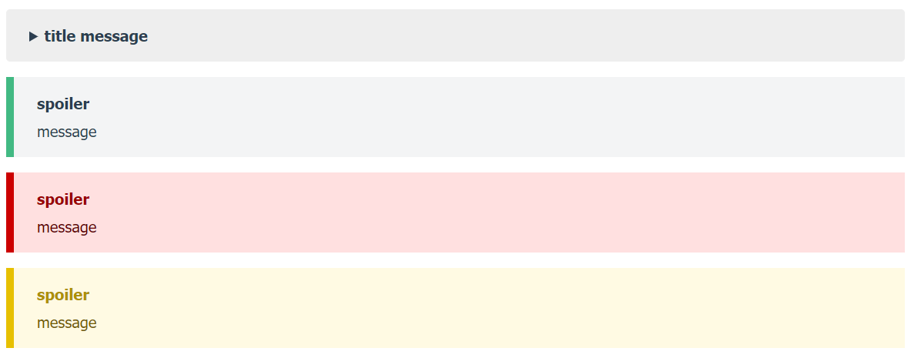

# markdown-it-plugins [](https://www.npmjs.com/package/markdown-it-plugins)

A collection of plug-ins that extend the Markdown-it parser.

## Install

```shell
npm i markdown-it-plugins -D
```

## Usage
```js
import MarkdownIt from 'markdown-it'
import { noticeboard } from 'markdown-it-plugin'

const markdown = new Markdown({
  // ...
})
  .use(noticeboard)
```

## Plugins

### container
Use Vue.js style content blocks to present your message.

```js
import { container } from 'markdown-it-plugins'
// preset styles
import 'markdown-it-plugins/container.css'

markdown.use(container)
```

#### Example
Optional values: [**tip** | **warning** | **danger** | **details** ]


TIP:
```
::: <type> [title]
  content message
:::
```

```
::: details title message
message
:::

::: tip spoiler
message
:::

::: warning spoiler
message
:::

::: danger spoiler
message
:::
```

### noticeboard
A lightweight prompt box containing only tip and Danger types.


```js
import { noticeboard } from 'markdown-it-plugins'
import 'markdown-it-plugins/noticeboard.css'

markdown.use(noticeboard)
```

#### Example

```
?> This is tip.
!> This is danger.
```

### collectBlockCode
To add foldable functionality to a code block, you can also give it a code block name.


```js
import { collectBlockCode } from 'markdown-it-plugins'
import 'markdown-it-plugins/collect-block-code.css'

markdown.use(collectBlockCode, options)
```

#### Options
```ts
interface CollectCodeBlock {
  /**
   * Show the code block language.
   * @type {boolean}
   * @default true
   */
  lang?: boolean

  /**
   * Shows the copy code block content button.
   * @type {boolean}
   * @default false
   */
  copy?: boolean

  /**
   * Copy the content button text.
   * @type {string}
   * @default: 'Copy'
   */
  copyText?: string

  /**
   * The delimiter for the code block name.
   * @type {string}
   * @default ':'
   */
  separator?: string

  /**
   * Display code block names.
   * @type {boolean}
   * @default false
   */
  blockName?: boolean

  /**
   * Always expand the code block.
   * @type {boolean}
   * @default true
   */
  alwaysOpen?: boolean
}
```

#### Example
````
```js : block name
console.log(1)
```
````
